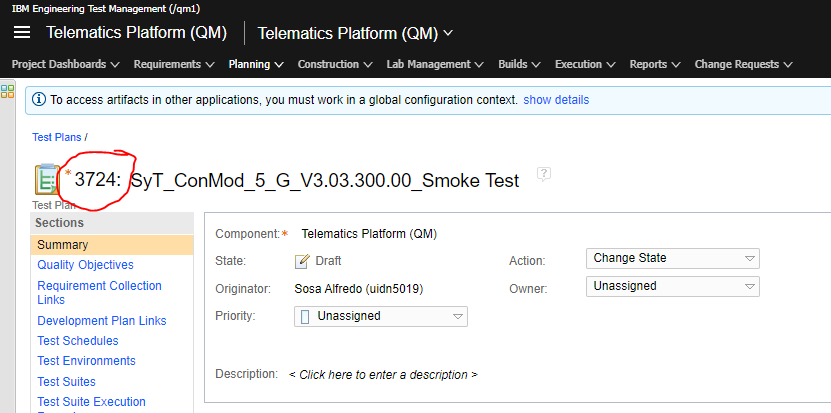

# This project moved to 
[https://github-vni.geo.conti.de/vni-ConMod/sw.conmod.integration.release.documentation_scripts](https://github-vni.geo.conti.de/vni-ConMod/sw.conmod.integration.release.documentation_scripts)

---
---

# create_release_note_json

## How to install required packages
`pip3 install -r requirements.txt`

## How to run
`python create_release_note_json.py --number_release_note <RELEASE_NOTE_NUMBER> --test_plan_id <TEST_PLAN_ID>`

Example: 
`python create_release_note_json.py --number_release_note CONMOD_5_G_Vcl43-03.03.300.00_CW23.03.1 --test_plan_id 3724`

### How to get the <TEST_PLAN_ID>

# Credentials
## Overview about the credentials, which are needed
After start of the script, you will get a GUI like the following one.\
In the GUI you can set your credentials, which will be saved secure and encrypted with your windows password in your Windows environment.\
The GUI script will look, if the specific credentials are set in your Windows environment. \
And if it is set, the field is "green", else it is "red".\
It will only check, if the credential is available. It can't proof for correctness.\

## How to set Credentials
If a field is red, then type your credential for this field and click on the "Save this credential!" button in the same row.\
This will save this specific Credential into your Windows secure environment.\
At the next run of your Script, they will read the credential from your Windows secure environment.

## How to get klocwork `user` and `token`
### Generate token:
1. Open `cmd.exe`
2run `set kwserver=https://dpas007x.dp.us.conti.de:8092`
3. run `set kwpath=\\cw01.contiwan.com\wetp\did65022\SCCWin10\klocwork\User\20.1\bin`
4. run `%kwpath%\kwauth --url %kwserver%`
5. Follow the instruction in the prompt (The command can run until 2 minutes => be patient)

### Get the token:
1. Go to `C:\Users\<your_user>\.klocwork`
2. Open the `ltoken` file
3. Each line has the following structure: `<server>;<port>;<user_for_auth>;<token>`
4. Copy the `<user_for_auth>` and `<token>` information to the gui of the script

## After setting the credentials run the script
After setting up all credentials, click on "Run script" button and the script will create the "output.json" file
